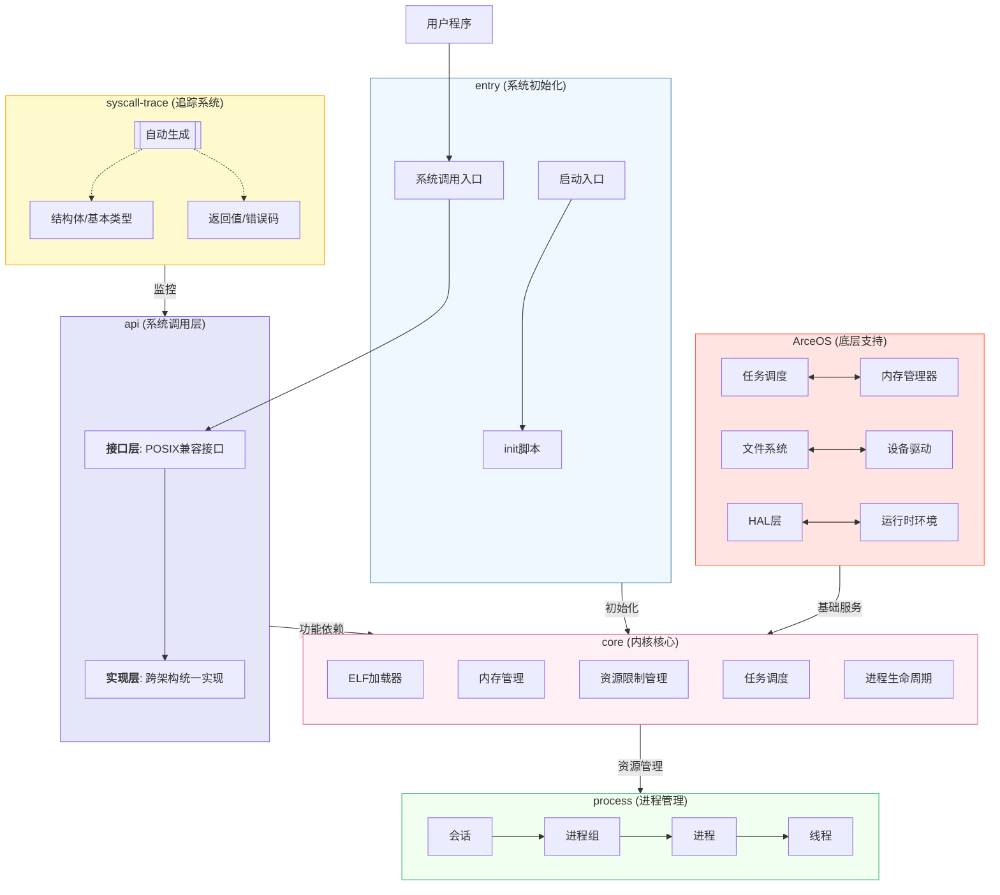

# 总体架构设计

```mermaid
graph TB
  %% ========== 主模块样式 ==========
  style Entry fill:#F0F8FF,stroke:#4682B4
  style Core fill:#FFF0F5,stroke:#DB7093
  style API fill:#E6E6FA,stroke:#9370DB
  style Process fill:#F0FFF0,stroke:#3CB371
  style Trace fill:#FFFACD,stroke:#FFA500
  style ArceOS fill:#FFE4E1,stroke:#FF6347

  %% ========== 模块定义 ==========
  subgraph Entry["entry (系统初始化)"]
    direction TB
    启动入口 --> init脚本
    系统调用入口
  end

  subgraph Core["core (内核核心)"]
    direction TB
    ELF加载器
    内存管理
    资源限制管理
    任务调度
    进程生命周期
  end

  subgraph API["api (系统调用层)"]
    direction TB
    接口层["<b>接口层</b>: POSIX兼容接口"] --> 实现层["<b>实现层</b>: 跨架构统一实现"]
  end

  subgraph Process["process (进程管理)"]
    direction LR
    会话 --> 进程组 --> 进程 --> 线程
  end

  subgraph Trace["syscall-trace (追踪系统)"]
    direction TB
    日志生成器[[自动生成]] -.-> 参数记录器["结构体/基本类型"]
    日志生成器 -.-> 结果解析器["返回值/错误码"]
  end

  subgraph ArceOS["ArceOS (底层支持)"]
    direction LR
    调度器["任务调度"] <--> 内存管理器
    文件系统 <--> 设备驱动
    HAL层 <--> 运行时环境
  end

  %% ========== 模块连接关系 ==========
  Entry -->|初始化| Core
  Core -->|资源管理| Process
  API -->|功能依赖| Core
  Trace -->|监控| API
  ArceOS -->|基础服务| Core
  用户程序 --> 系统调用入口
  系统调用入口 --> 接口层
```
