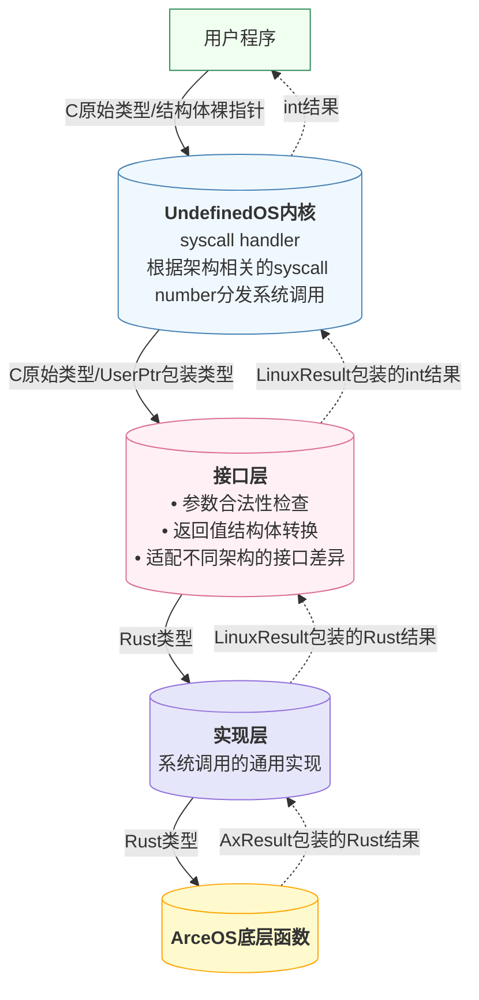

# 系统调用架构设计

我们采取了**接口**和**实现**分离的系统调用设计。

## 设计目标

这个设计的初衷是，我们发现许多系统调用有着相似的名字和类似的功能，往往存在部分系统调用的功能是重叠的，或者是包含在其他系统调用中的。这其中有一部分的历史原因，Linux在演进的过程中，不可避免地会因为旧系统调用的缺陷而引入新的改进版本的系统调用，从而导致了系统调用的重复和冗余。例如 `stat`, `fstat`, `lstat`, `statx`, `fstatat`，以及 `poll`, `ppoll`, `select`, `pselect`等系统调用。我们希望在实现系统调用时，能够将这些系统调用的实现进行整合，避免重复的代码和不必要的复杂性。因为如果为功能相近的若干系统调用分别实现一遍代码，可能在排查问题或者需要进行修复时，需要在多个地方进行修改，存在遗漏的风险。

此外，虽然我们的目标是提供Linux兼容的POSIX API，但如果未来我们希望支持其他OS的API，或者提供我们OS的自定义API，那么这种结构的划分也会让我们在实现时更加灵活。

## 设计思想

具体设计结构图如下：

具体地，我们整合一类功能相近或彼此包含的系统调用，实现一个通用的实现函数以完成它们的功能的并集，作为**实现**部分。然后为每个系统调用单独提供一个**接口**函数，作为对应用程序的接口，函数内进行参数的检查和转换，以合适的参数组合调用对应的实现函数。具体规范包含下面的部分：

- **实现**部分的函数名为 `sys_XXX_impl`，其中 `XXX`为系统调用的名称。实现部分的函数参数和返回值都是rust原生类型，不涉及指针读写和数据结构转换等工作，只关心系统调用功能实现。
- **接口**部分的函数名为 `sys_XXX`，其中 `XXX`为系统调用的名称。接口部分的函数参数和返回值为POSIX标准定义的类型，函数内进行参数的检查和转换，以合适的参数组合调用对应的实现函数。接口部分的函数需要处理指针读写和数据结构转换等工作，可能会涉及到unsafe代码。
- **接口**部分的函数参数主要有两类：一类是rust定义的c语言接口类型，如 `c_int`等，另一类是指针类型。此处我们对用户指针类型进一步进行了语义化包装，命名为 `UserInPtr<T>`, `UserOutPtr<T>`, `UserInOutPtr<T>`，分别表示输入指针、输出指针和输入输出指针。我们在实现时，使用这些语义化的指针类型来替代原有的指针类型，以提高代码的可读性和可维护性，同时便于添加合适的权限和边界检查。
- **接口**部分的函数可能需要处理数据结构转换等工作，在**实现**部分返回的结构体为内核的内部类型，可能和POSIX标准中规定的和用户交互的类型有所不同。甚至，在不同的架构下，Linux规定的数据结构也可能会有所不同，可能存在字段顺序不同、字段大小不同等问题。我们在实现时，使用 `#[repr(C)]`属性来指定数据结构的内存布局，同时针对不同的架构，使用 `cfg`宏来管理不同架构下的用户结构体。
